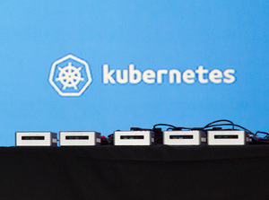

# pxe-coreos
PXE tftp os-x setup

Mikel Nelson 5/26/2015



## Purpose 
This Repository attempts to capture the setup of a Linux PXE boot system to load CoreOS onto net booted Machines/VMs.

## Environment
This was created on the following network setup:

* m0n0wall (pfsense) firewall
	* LAN Subnet
	* DHCP
* OS-X Mac Mini 
	* tftp - pxe boot files
	* http - cloud configuration files
* Bare Metal or VirtualBox VM


## Setup 
### Enable a tftp server
OS-X comes with a tftp server installed, all you have to do is enable it.
Good reference page: [http://hints.macworld.com/article.php?story=20070218233806794](http://)

* Backup the original tftp.plist

      cp /System/Library/LaunchDaemons/tftp.plist ~/Desktop/tftp.plist
      (or wherever you want...)
      
* Modify `/System/Library/LaunchDaemons/tftp.plist` add `-s` argument.  Everything else should be ok.

      <?xml version="1.0" encoding="UTF-8"?>
      <!DOCTYPE plist PUBLIC "-//Apple Computer//DTD PLIST 1.0//EN" "http://www.apple.com/DTDs/      PropertyList-1.0.dtd">
      <plist version="1.0">
      <dict>
              <key>Disabled</key>
              <true/>
              <key>Label</key>
              <string>com.apple.tftpd</string>
              <key>ProgramArguments</key>
              <array>
                      <string>/usr/libexec/tftpd</string>
                      <string>-i</string>
                      <string>-s</string>
                      <string>/private/tftpboot</string>
              </array>
              <key>inetdCompatibility</key>
              <dict>
                      <key>Wait</key>
                      <true/>
              </dict>
              <key>InitGroups</key>
              <true/>
              <key>Sockets</key>
              <dict>
                      <key>Listeners</key>
                      <dict>
                              <key>SockServiceName</key>
                              <string>tftp</string>
                              <key>SockType</key>
                              <string>dgram</string>
                      </dict>
              </dict>
      </dict>
      </plist>
      
* The `/private/tftpboot` directory should already exist on the system.
* Start the tftpd server:

      $ sudo launchctl load -w /System/Library/LaunchDaemons/tftp.plist
      
* To upload any file to the tftpd server, it must already exist and be world writable.  e.g.

      $ cd /private/tftpboot
      $ sudo touch testfile.txt
      $ sudo chmod 666 testfile.txt
      
      At this point, you're ready to start using the service to store data as needed. For testing, you can perform the following:
      
      $ cd ~/Desktop
      $ echo "THIS IS A TEST" > testfile.txt
      $ tftp localhost
      
      This will open a tftp connection and switch to an interactive tftp session. Now perform the following:
      
      tftp>verbose
      tftp>put testfile.txt
      tftp>quit

### Setup The CoreOS PXE Files

#### Summary of PXE setup:

* All these files should be placed in the root directory of the tftp server. In our example: `/private/tftpboot` 
* A version of `pxelinux.0`.  This is the initial boot file PXE pulls from the tftp server.  The linux distribution really doesn't matter as we will use it to pull the CoreOS files onto the system.  This example will use Debian.
* `pxelinux.cfg` directory with at least a `default` file.  This is the configuration file that controls what is loaded next.  It also can present the boot menus.
* Some distribution of CoreOS.

#### References:
* CoreOS Boot from PXE: [https://coreos.com/docs/running-coreos/bare-metal/booting-with-pxe/](http://)
* PXE Oracle Example: [https://docs.oracle.com/cd/E24628_01/em.121/e27046/appdx_pxeboot.htm#EMLCM12198](http://)
* PXE Linux: [http://www.syslinux.org/wiki/index.php/PXELINUX](http://)
* Debian Net Boot (Down the page at Provie the boot image): [https://wiki.debian.org/PXEBootInstall](http://)
* Debian distro files for Netboot: [http://www.debian.org/distrib/netinst#netboot](http://)

#### The Setup

    $ pwd
    /private/tftpboot
    $ ls -laF
    drwxr-xr-x   2 root  wheel   68 Oct 16  2014 NetBoot/
    drwxr-xr-x   7 root  wheel  238 May 27 08:08 coreos-alpha/
    drwxr-xr-x   5 root  wheel  170 May 27 07:56 coreos-installer/
    drwxrwxr-x   3 root  wheel  102 Apr 22 15:11 debian-installer/
    lrwxr-xr-x   1 root  wheel   41 May 27 08:21 ldlinux.c32@ -> coreos-installer/boot-screens/ldlinux.c32
    lrwxr-xr-x   1 root  wheel   33 May 26 17:57 pxelinux.0@ -> debian-installer/amd64/pxelinux.0
    lrwxr-xr-x   1 root  wheel   29 May 27 08:09 pxelinux.cfg@ -> coreos-installer/pxelinux.cfg

Notes:

* `NetBoot` is supplied by OS-X server and not applicable for our system.
* `coreos-alpha` contians the CoreOS Alpha channel OS install images
* `coreos-installer` contains the CoreOS install menus and configurations
* `debian-installer` came from the Debian netboot download
* `ldlinux.c32` is only needed if color menus etc are used.  Text only does not need this.
* `pxelinux.0` links to the Debian version of pxelinux.0.  That is really the only file needed.
* `pxelinux.cfg` links to the configuration directory to use.

##### Configuration Menus
The current setup presents a menu that allows selection of the desired CoreOS channel install.  This example only has the `coreos-alpha` directory populated, but you can easily add `coreos-beta` and `coreos-stable` direcotries along with the correct files.

##### File Trees

CoreOS Alpha.  (see [https://coreos.com/docs/running-coreos/bare-metal/booting-with-pxe/](http://) )

    coreos-alpha
    ├── coreos_production_pxe.vmlinuz
    ├── coreos_production_pxe.vmlinuz.sig
    ├── coreos_production_pxe_image.cpio.gz
    └── coreos_production_pxe_image.cpio.gz.sig

PXE Configuration

    coreos-installer/
    ├── README.md
    ├── boot-screens
    │   ├── boot.msg
    │   ├── exithelp.cfg
    │   ├── fastboot.cfg
    │   ├── kraken.png
    │   ├── ldlinux.c32
    │   ├── libcom32.c32
    │   ├── libutil.c32
    │   ├── menu.cfg
    │   ├── prompt.cfg
    │   ├── stdmenu.cfg
    │   ├── syslinux.cfg
    │   ├── txt.cfg
    │   └── vesamenu.c32
    └── pxelinux.cfg
        └── default -> ../boot-screens/syslinux.cfg
        
        
Note: `default` may link to either `syslinux.cfg` (for menu selection start) or `fastboot.cfg` (which just starts up CoreOS Alpha).   Also, `fastboot.cfg` only needs `boot.msg`.  `syslinux.cfg` needs all the other files listed due to VGA menus.

The most relevant file to edit is: `txt.cfg`

    default install-alpha
    label install-alpha
	    menu label ^Install Alpha Channel
	    menu default
	    kernel coreos-alpha/coreos_production_pxe.vmlinuz
	    append initrd=coreos-alpha/coreos_production_pxe_image.cpio.gz console=tty0
        #	append initrd=coreos-coreos_production_pxe_image.cpio.gz cloud-config-url=http://<your server>/pxe-cloud-config.yml

    label install-beta
    	menu label ^Install Beta Channel
    	kernel coreos-beta/coreos_production_pxe.vmlinuz
    	append initrd=coreos-beta/coreos_production_pxe_image.cpio.gz console=tty0
        #	append initrd=coreos-coreos_production_pxe_image.cpio.gz cloud-config-url=http://example.com/pxe-cloud-config.yml

    label install-stable
    	menu label ^Install Stable Channel
    	kernel coreos-stable/coreos_production_pxe.vmlinuz
    	append initrd=coreos-stable/coreos_production_pxe_image.cpio.gz console=tty0
        #	append initrd=coreos-coreos_production_pxe_image.cpio.gz cloud-config-url=http://example.com/pxe-cloud-config.yml

## Install
sudo cp the directories from this project to the correct location on you tftp server.

## Configure DHCP for PXE

On the firewall DHCP setup:
* Set `Next server` to the name or IP of the tftp server
* Set the `Filename` to `pxelinux.0`

## Testing
### VirtualBox
Create a new VM with no disk drive, and set the network to `bridged` and `netboot`.


# Running A Kubernetes Cluster
This section superceeds the previous.

Based on these instructions: [https://github.com/GoogleCloudPlatform/kubernetes/blob/release-1.0/docs/getting-started-guides/docker-multinode/master.md](https://github.com/GoogleCloudPlatform/kubernetes/blob/release-1.0/docs/getting-started-guides/docker-multinode/master.md)

## Modifications
The above Kubernetes instructions need to be modified as follows:

* etcd2 is running as a service on node-01, and proxy on all other nodes (vs container)
* flanneld is running as a service on all nodes (vs container)
* You can avoid all the delete/etc/ sockets etc and proceed to the running sections.
* Use image quay.io/mikeln/hypercube:v1.0.1  (built via the mikeln/kube-local-build project)
* Make sure you set a FQDN that DNS can resolve to an IP address for each node.  E.g. for my setup:
	* samnuc01.mineco.lab  10.22.6.241
	* samnuc02.mineco.lab  10.22.6.242
	* samnuc03.mineco.lab  10.22.6.243
	* NOTE: you can use `hostnamectl set-hostname` on coreos after the fact.
* Master e.g.
	*	`docker run --net=host -d -v /var/run/docker.sock:/var/run/docker.sock  quay.io/mikeln/hyperkube:v1.0.1 /hyperkube kubelet --api_servers=http://localhost:8080 --v=2 --address=0.0.0.0 --hostname_override=$(hostname -i) --enable_server --config=/etc/kubernetes/manifests-multi`
	* `docker run -d --net=host --privileged quay.io/mikeln/hyperkube:v1.0.1 /hyperkube proxy --master=http://127.0.0.1:8080 --v=2`
* Node e.g
	* `sudo docker run --net=host -d -v /var/run/docker.sock:/var/run/docker.sock quay.io/mikeln/hyperkube:v1.0.1 /hyperkube kubelet --api_servers=http://10.22.6.241:8080 --v=2 --address=0.0.0.0 --enable_server --hostname_override=$(hostname -i)`
	* `sudo docker run -d --net=host --privileged quay.io/mikeln/hyperkube:v1.0.1 /hyperkube proxy --master=http://10.22.6.241:8080 --v=2`
	

## Example Output
````
l2067532491-mn:hyperkube mikel_nelson$ kub get nodes -o wide
NAME          LABELS                               STATUS
10.22.6.241   kubernetes.io/hostname=10.22.6.241   Ready
10.22.6.242   kubernetes.io/hostname=10.22.6.242   Ready
10.22.6.243   kubernetes.io/hostname=10.22.6.243   Ready
````
````
l2067532491-mn:hyperkube mikel_nelson$ kub get pods -o wide
NAME                     READY     STATUS    RESTARTS   AGE       NODE
k8s-master-10.22.6.241   3/3       Running   0          13m       10.22.6.241
nginx-940xj              1/1       Running   0          1m        10.22.6.242
nginx-eo44c              1/1       Running   0          7m        10.22.6.241
nginx-k3ypx              1/1       Running   0          7m        10.22.6.243
````
````
l2067532491-mn:hyperkube mikel_nelson$ kub get services
NAME         LABELS                                    SELECTOR    IP(S)        PORT(S)
kubernetes   component=apiserver,provider=kubernetes   <none>      10.0.0.1     443/TCP
nginx        run=nginx                                 run=nginx   10.0.0.125   80/TCP
````
````
l2067532491-mn:hyperkube mikel_nelson$ kub get rc
CONTROLLER   CONTAINER(S)   IMAGE(S)   SELECTOR    REPLICAS
nginx        nginx          nginx      run=nginx   3
`````
